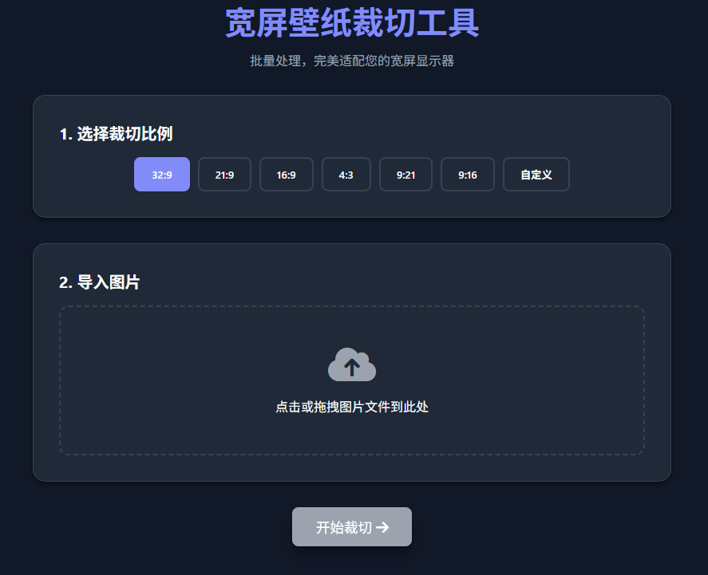

# WallpaperClip v4

一个现代化的壁纸批量裁切工具，专为超宽屏用户设计。支持批量导入图片，提供多种预设比例（如32:9、21:9、16:9等），智能裁切框，实时预览，并支持明亮/暗黑主题切换。纯前端实现，保护隐私，无需上传服务器。

## 预览

## 功能特性

- **现代化UI设计**：
  - 支持明亮/暗黑主题切换，自动适配系统偏好。
  - 响应式布局，完美适配各种屏幕尺寸。

- **图片裁切功能**：
  - 支持批量导入图片（支持常见图片格式）。
  - 提供多种常用宽屏比例预设：32:9, 21:9, 16:9, 4:3, 9:21, 9:16。
  - 支持自定义裁切比例。
  - 智能裁切框：
    - 自动最大化适配图片，不拉伸。
    - 智能限制移动方向（根据图片和裁切比例自动判断）。
    - 实时预览裁切效果，半透明遮罩覆盖非裁切区域。

- **全屏预览**：
  - 新增裁切框内容实时预览功能。
  - 支持全屏模式预览，完美适配32:9等超宽带鱼屏显示器。
  - 沉浸式黑色背景，消除干扰，还原真实壁纸效果。
  - 点击任意位置或按Esc键快速退出预览。

- **流程优化**：
  - 悬浮式控制面板，支持拖拽移动，不遮挡视线。
  - "跳过"与"下一个"快捷操作。
  - 裁切完成后自动打包为ZIP压缩包下载，文件名包含精确时间戳。

- **性能优化**：
  - 纯前端处理，使用Canvas高性能绘图。
  - 无需安装，打开即用。

## 使用方法

1. 下载项目文件到本地。
2. 在浏览器中打开 `index.html` 文件。
3. 点击导入按钮，选择要裁切的壁纸图片（支持批量选择）。
4. 选择裁切比例（预设或自定义）。
5. 点击"开始"进入裁切流程。
6. 在裁切界面中，拖动裁切框调整位置，点击"下一个"或"跳过"。
7. 完成后，自动下载包含裁切后图片的ZIP压缩包。

## 更新日志

### v1.1 (2026-03-15)

#### 新增功能
- **全屏预览**：
  - 新增裁切框内容实时预览功能。
  - 支持全屏模式预览，完美适配 32:9 等超宽带鱼屏显示器。
  - 沉浸式黑色背景，消除干扰，还原真实壁纸效果。
  - 点击任意位置或按 Esc 键即可快速退出预览。

#### 优化
- **交互体验**：
  - 优化预览模态框样式与动画。
  - 自动处理全屏状态切换。

### v1.0 (2026-03-15)

#### 新增功能
- **现代化 UI 设计**：
  - 支持明亮/暗黑主题切换，自动适配系统偏好。
  - 采用响应式布局，完美适配各种屏幕尺寸。
- **图片裁切功能**：
  - 支持批量导入图片。
  - 提供多种常用宽屏比例预设（32:9, 21:9, 16:9, 4:3, 9:21, 9:16）。
  - 支持自定义裁切比例。
  - 智能裁切框：
    - 自动最大化适配图片，不拉伸。
    - 智能限制移动方向（如 16:9 图片裁切 32:9 时仅允许上下移动）。
    - 实时预览裁切效果，半透明遮罩覆盖非裁切区域。
- **流程优化**：
  - 悬浮式控制面板，支持拖拽移动，不遮挡视线。
  - "跳过"与"下一个"快捷操作。
  - 裁切完成后自动打包为 ZIP 压缩包下载，文件名包含精确时间戳。
- **性能优化**：
  - 纯前端处理，保护隐私，无须上传服务器。
  - 使用 Canvas 高性能绘图。

## 贡献

欢迎提交Issue和Pull Request来改进这个项目。

## 许可证

本项目采用 MIT 许可证。